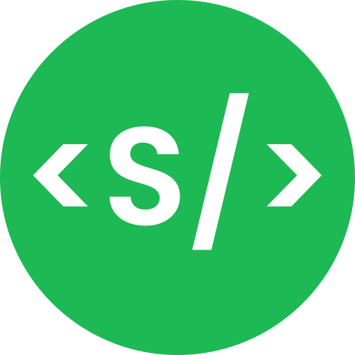

<p align="center">
    
</p>

<h1 align="center">
    Spotify Status Widget
</h1>

<p align="center">
  A simple widget to display your current Spotify status on your website or GitHub profile.

  <br />

  

  <br />
</p>

## Usage

To uses this CLI, install it using your Node package manager of choice:

```bash
npm create spotify-status-widget@latest
```

```bash
yarn create spotify-status-widget@latest
```

```bash
pnpm create spotify-status-widget@latest
```

## Setup

To setup the widget, you will need to create a Spotify application. You can do this by going to the [Spotify Developer Dashboard](https://developer.spotify.com/dashboard/applications) and creating a new application.


Once you have created your application, you will need to add your redirect URI. This is the URL that Spotify will redirect to after you have logged in. Set this as `http://localhost:3000` as this is something that the CLI will handle automatically.

When the project is created you will be redirected to the Spotify App dashboard. Here you will need to navigate to the `Settings` page and copy your `Client ID` and `Client Secret`. You will need these to configure the CLI.


Now run the CLI using your preferred package manager, and you will be prompted to change some settings. The defaults are recommended, and you can always change them later. You will be prompted to enter the Client ID and Client Secret that you copied earlier. After this initial setup, a link will be created for you to follow, this will redirect you to login to Spotify and give your version of Spotify Status Widget access to your account. After you have logged in, you will be redirected to `http://localhost:3000` and you will see a page that says `Got the code, you may now close this window and return to the CLI!`. You can now close this window and return to your terminal. The CLI will now continue to generate your project. A few more options may popup in edge case scenarios, but after this, your project will be generated and you can start using it!

## Deploying

To deploy your project, you will need to create a [Vercel](https://vercel.com) account. Once you have created your account, you can add the generated project from the CLI to your Github and follow these [instructions](https://vercel.com/docs/concepts/deployments/git/vercel-for-github) to deploy your project on the Vercel platform.

## Usage of the Widget

| Endpoint | Description |
| --- | --- |
| `/api/now-playing` | Returns the current song that you are listening to. |
| `/api/now-playing/image` | Returns the current song that you are listening to as an image. |

*More to come.*

## CLI Options

| Option | Description | Default |
| --- | --- | --- |
| `--noGit` | Do not initialize a new git repo in the generated project | `false` |
| `--noInstall` | Do not install dependencies after generating the project | `false` |
| `--spotifyClientId` | Your Spotify Client ID | `empty` |
| `--spotifyClientSecret` | Your Spotify Client Secret | `empty` |

## Contributing

Pull requests are welcome. For major changes, please open an issue first to discuss what you would like to change.

## License

This project is licensed under the MIT License. See the [LICENSE.md](LICENSE.md) file for details.
